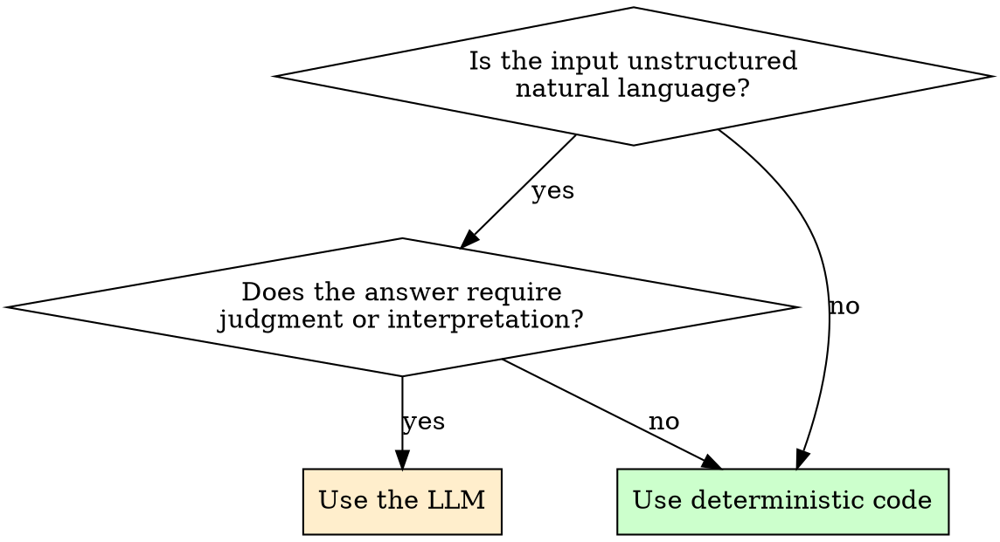

# Prefer Deterministic Code

## Overview

An LLM call is the wrong tool when the question has a deterministic answer. Use it for unstructured language work (classify, summarize, extract from messy text). For everything else, write the code.

**Core principle:** A flaky `if/else` charged at per-token rates is worse than an `if/else`.

## When to Use This Skill

You are about to wire an LLM call into application logic, an agent loop, or a workflow step. Stop and ask:

- Does this question have a single right answer that a deterministic function could compute?
- Would I be embarrassed if the LLM gave a different answer to the same input next week?

If either is "yes," do not delegate it to the model.

## The Decision Rule

## Good Uses of an LLM Call

- Classify free-form user messages into intents
- Summarize a document
- Extract structured fields from unstructured text
- Draft natural-language output
- Answer open-ended questions over a knowledge base

## Bad Uses (write code instead)

- Deciding whether to retry on a specific HTTP status code
- Routing a request based on a header or path
- Mapping an enum to a label
- Validating that a string is a valid email
- Computing a hash, a checksum, or a digest
- Branching on whether a record already exists in the database

## Red Flags

These thoughts mean STOP — you are about to make an LLM do an `if/else`:

| Thought | Reality |
|---|---|
| "The LLM is more flexible if requirements change" | Code is cheap to change. Stable behavior is cheaper. |
| "It'll handle edge cases I haven't thought of" | It will handle them differently each time. |
| "I can describe the rule in English faster than I can code it" | The rule will drift each time the prompt is touched. |
| "We already have an LLM client set up" | Available ≠ appropriate. |
| "It's just one call" | Per-call non-determinism compounds across the system. |

## When Behavior Was Already Wired to an LLM

If you find existing code that calls the LLM for a deterministic question, do not silently fix it — that violates **Surgical Changes** (Karpathy rule 3). Flag it to your human partner, propose the deterministic replacement, and wait for approval.

Full text of supporting Karpathy principles: see the `karpathy-guidelines` skill.
