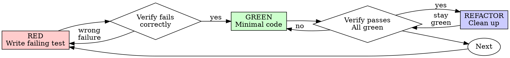

# Test-Driven Development (TDD)

## Karpathy Reinforcement

While running the TDD cycle, also apply:
- **Simplicity First** (Karpathy rule 2) — GREEN means the *minimum* code that makes the test pass. If your GREEN step grew speculative features, delete and restart.
- **Surgical Changes** (Karpathy rule 3) — during RED-GREEN, do not touch unrelated code. Save broader cleanup for an explicit refactor pass with green tests.
- **Goal-Driven Execution** (Karpathy rule 4) — TDD *is* goal-driven execution: the failing test is the success criterion. Loop until it goes green.

Full text: see the `karpathy-guidelines` skill.

## Test Quality Bar

A test must encode *why* the behavior matters, not just *that* the function returned something. If the test would still pass when a developer replaces the function body with `return <hardcoded value>`, the test is worthless — delete it and write a real one.

Checklist before accepting a green test:
- Does the assertion depend on the input, not on a constant?
- Does the test fail if the business rule changes?
- Could a buggy implementation that swallows errors still pass it? If yes, the test is shallow.

For architectural and behavioral reinforcement of the RED-GREEN-REFACTOR cycle (outside-in ordering, behavior-not-implementation, organization, layering), see the [Reinforcement](#reinforcement) section at the end of this skill. The Iron Law and Red-Green-Refactor cycle below come first because they are the unconditional foundation; the reinforcement sections sharpen the cycle but never override it.

## Overview

Write the test first. Watch it fail. Write minimal code to pass.

**Core principle:** If you didn't watch the test fail, you don't know if it tests the right thing.

**Violating the letter of the rules is violating the spirit of the rules.**

## When to Use

**Always:**
- New features
- Bug fixes
- Refactoring
- Behavior changes

**Exceptions (ask your human partner):**
- Throwaway prototypes
- Generated code
- Configuration files

Thinking "skip TDD just this once"? Stop. That's rationalization.

## The Iron Law

```
NO PRODUCTION CODE WITHOUT A FAILING TEST FIRST
```

Write code before the test? Delete it. Start over.

**No exceptions:**
- Don't keep it as "reference"
- Don't "adapt" it while writing tests
- Don't look at it
- Delete means delete

Implement fresh from tests. Period.

## Red-Green-Refactor



### RED - Write Failing Test

Write one minimal test showing what should happen.

<Good>
```typescript
test('retries failed operations 3 times', async () => {
  let attempts = 0;
  const operation = () => {
    attempts++;
    if (attempts < 3) throw new Error('fail');
    return 'success';
  };

  const result = await retryOperation(operation);

  expect(result).toBe('success');
  expect(attempts).toBe(3);
});
```
Clear name, tests real behavior, one thing
</Good>

<Bad>
```typescript
test('retry works', async () => {
  const mock = jest.fn()
    .mockRejectedValueOnce(new Error())
    .mockRejectedValueOnce(new Error())
    .mockResolvedValueOnce('success');
  await retryOperation(mock);
  expect(mock).toHaveBeenCalledTimes(3);
});
```
Vague name, tests mock not code
</Bad>

**Requirements:**
- One behavior
- Clear name
- Real code (no mocks unless unavoidable)

### Verify RED - Watch It Fail

**MANDATORY. Never skip.**

```bash
npm test path/to/test.test.ts
```

Confirm:
- Test fails (not errors)
- Failure message is expected
- Fails because feature missing (not typos)

**Test passes?** You're testing existing behavior. Fix test.

**Test errors?** Fix error, re-run until it fails correctly.

### GREEN - Minimal Code

Write simplest code to pass the test.

<Good>
```typescript
async function retryOperation<T>(fn: () => Promise<T>): Promise<T> {
  for (let i = 0; i < 3; i++) {
    try {
      return await fn();
    } catch (e) {
      if (i === 2) throw e;
    }
  }
  throw new Error('unreachable');
}
```
Just enough to pass
</Good>

<Bad>
```typescript
async function retryOperation<T>(
  fn: () => Promise<T>,
  options?: {
    maxRetries?: number;
    backoff?: 'linear' | 'exponential';
    onRetry?: (attempt: number) => void;
  }
): Promise<T> {
  // YAGNI
}
```
Over-engineered
</Bad>

Don't add features, refactor other code, or "improve" beyond the test.

### Verify GREEN - Watch It Pass

**MANDATORY.**

```bash
npm test path/to/test.test.ts
```

Confirm:
- Test passes
- Other tests still pass
- Output pristine (no errors, warnings)

**Test fails?** Fix code, not test.

**Other tests fail?** Fix now.

### REFACTOR - Clean Up

After green only:
- Remove duplication
- Improve names
- Extract helpers

Keep tests green. Don't add behavior.

### Repeat

Next failing test for next feature.

## Good Tests

| Quality | Good | Bad |
|---------|------|-----|
| **Minimal** | One thing. "and" in name? Split it. | `test('validates email and domain and whitespace')` |
| **Clear** | Name describes behavior | `test('test1')` |
| **Shows intent** | Demonstrates desired API | Obscures what code should do |

## Why Order Matters

**"I'll write tests after to verify it works"**

Tests written after code pass immediately. Passing immediately proves nothing:
- Might test wrong thing
- Might test implementation, not behavior
- Might miss edge cases you forgot
- You never saw it catch the bug

Test-first forces you to see the test fail, proving it actually tests something.

**"I already manually tested all the edge cases"**

Manual testing is ad-hoc. You think you tested everything but:
- No record of what you tested
- Can't re-run when code changes
- Easy to forget cases under pressure
- "It worked when I tried it" ≠ comprehensive

Automated tests are systematic. They run the same way every time.

**"Deleting X hours of work is wasteful"**

Sunk cost fallacy. The time is already gone. Your choice now:
- Delete and rewrite with TDD (X more hours, high confidence)
- Keep it and add tests after (30 min, low confidence, likely bugs)

The "waste" is keeping code you can't trust. Working code without real tests is technical debt.

**"TDD is dogmatic, being pragmatic means adapting"**

TDD IS pragmatic:
- Finds bugs before commit (faster than debugging after)
- Prevents regressions (tests catch breaks immediately)
- Documents behavior (tests show how to use code)
- Enables refactoring (change freely, tests catch breaks)

"Pragmatic" shortcuts = debugging in production = slower.

**"Tests after achieve the same goals - it's spirit not ritual"**

No. Tests-after answer "What does this do?" Tests-first answer "What should this do?"

Tests-after are biased by your implementation. You test what you built, not what's required. You verify remembered edge cases, not discovered ones.

Tests-first force edge case discovery before implementing. Tests-after verify you remembered everything (you didn't).

30 minutes of tests after ≠ TDD. You get coverage, lose proof tests work.

## Common Rationalizations

| Excuse | Reality |
|--------|---------|
| "Too simple to test" | Simple code breaks. Test takes 30 seconds. |
| "I'll test after" | Tests passing immediately prove nothing. |
| "Tests after achieve same goals" | Tests-after = "what does this do?" Tests-first = "what should this do?" |
| "Already manually tested" | Ad-hoc ≠ systematic. No record, can't re-run. |
| "Deleting X hours is wasteful" | Sunk cost fallacy. Keeping unverified code is technical debt. |
| "Keep as reference, write tests first" | You'll adapt it. That's testing after. Delete means delete. |
| "Need to explore first" | Fine. Throw away exploration, start with TDD. |
| "Test hard = design unclear" | Listen to test. Hard to test = hard to use. |
| "TDD will slow me down" | TDD faster than debugging. Pragmatic = test-first. |
| "Manual test faster" | Manual doesn't prove edge cases. You'll re-test every change. |
| "Existing code has no tests" | You're improving it. Add tests for existing code. |

## Red Flags - STOP and Start Over

- Code before test
- Test after implementation
- Test passes immediately
- Can't explain why test failed
- Tests added "later"
- Rationalizing "just this once"
- "I already manually tested it"
- "Tests after achieve the same purpose"
- "It's about spirit not ritual"
- "Keep as reference" or "adapt existing code"
- "Already spent X hours, deleting is wasteful"
- "TDD is dogmatic, I'm being pragmatic"
- "This is different because..."

**All of these mean: Delete code. Start over with TDD.**

## Example: Bug Fix

**Bug:** Empty email accepted

**RED**
```typescript
test('rejects empty email', async () => {
  const result = await submitForm({ email: '' });
  expect(result.error).toBe('Email required');
});
```

**Verify RED**
```bash
$ npm test
FAIL: expected 'Email required', got undefined
```

**GREEN**
```typescript
function submitForm(data: FormData) {
  if (!data.email?.trim()) {
    return { error: 'Email required' };
  }
  // ...
}
```

**Verify GREEN**
```bash
$ npm test
PASS
```

**REFACTOR**
Extract validation for multiple fields if needed.

## Verification Checklist

Before marking work complete:

- [ ] Every new function/method has a test
- [ ] Watched each test fail before implementing
- [ ] Each test failed for expected reason (feature missing, not typo)
- [ ] Wrote minimal code to pass each test
- [ ] All tests pass
- [ ] Output pristine (no errors, warnings)
- [ ] Tests use real code (mocks only if unavoidable)
- [ ] Edge cases and errors covered

Can't check all boxes? You skipped TDD. Start over.

## When Stuck

| Problem | Solution |
|---------|----------|
| Don't know how to test | Write wished-for API. Write assertion first. Ask your human partner. |
| Test too complicated | Design too complicated. Simplify interface. |
| Must mock everything | Code too coupled. Use dependency injection. |
| Test setup huge | Extract helpers. Still complex? Simplify design. |

## Debugging Integration

Bug found? Write failing test reproducing it. Follow TDD cycle. Test proves fix and prevents regression.

Never fix bugs without a test.

## Testing Anti-Patterns

When adding mocks or test utilities, read @testing-anti-patterns.md to avoid common pitfalls:
- Testing mock behavior instead of real behavior
- Adding test-only methods to production classes
- Mocking without understanding dependencies

## Final Rule

```
Production code → test exists and failed first
Otherwise → not TDD
```

No exceptions without your human partner's permission.

---

## Reinforcement

The four sections below sharpen the cycle above. They are reinforcement, not replacement — none of them override the Iron Law or the Red Flags above. Read them after you have internalized the cycle.

### Where to Start the Cycle

The next RED test targets the **highest-uncovered architectural boundary**, not the lowest utility.

If `writing-plans` defined an interface for `OrderBookService.place(order)`, your first test exercises `OrderBookService.place(...)` — not a private helper inside it, not a string-formatting utility two layers down. You drill into helpers *only* when the boundary test forces you to (i.e., it cannot be made to pass without a helper that doesn't yet exist).

This is outside-in *ordering*, not London-school mocking. When you drill into a helper, write it with **real code, not mocks** — the existing TDD rules still apply.

| Question | Answer |
|---|---|
| Why start at the boundary? | Boundary tests are inherently behavior-tests; leaf-utility tests are easy to make implementation-coupled. |
| What if the boundary is huge? | The plan should have decomposed it. If it didn't, raise the gap before writing tests. |
| Can I mock the layers below the boundary? | Only if the layer is genuinely external (network, filesystem, time). For internal layers, prefer real. |

### Behavior, Not Implementation

A test asserts on **observable outputs and state transitions**, never on internal call shapes.

Forbidden assertion shapes (these test the implementation):
- `expect(spy).toHaveBeenCalledTimes(N)` (interrogating call counts)
- `expect(mock.foo).toHaveBeenCalledWith(...)` (interrogating arguments to internals)
- Reaching into private fields or non-public methods
- Snapshot-testing internal data structures the caller never sees

Allowed exceptions: when the side effect *is* the contract. A test for "an email gets sent" must assert that `emailGateway.send` was called with the right address — that observable side effect *is* the behavior, not an implementation detail.

The black-box test: if you refactor internals without changing the externally-observable result, **no test should break**. If one does, it was testing implementation.

**Mutation thinking** — before accepting a green test, mentally mutate the source:
- What if `+` became `-`? `<` became `<=`? `return result` became `return null`?
- What if errors were swallowed instead of thrown?
- What if the function returned the input unchanged?

If the test still passes under any of those mutations, write another test. Tools that automate this (Stryker for JS/TS, PIT for Java, Mutmut for Python) are the gold-standard verifier — optional, but worth running when stakes are high.

### Test Organization & Traceability

Tests are structurally aligned with the architecture, not thrown into a global `/tests` folder.

**Colocate** test files immediately adjacent to source unless the project convention says otherwise:
```
src/trading/order-book.ts
src/trading/order-book.test.ts   ← same directory
```
This makes the source ↔ test link undeniable and lets `--findRelatedTests`-style tools work.

**Name and group tests using canonical terms from `CONTEXT.md`** (your ubiquitous language glossary). If the canonical term is `Position`, the test file is `position.test.ts` and the top-level `describe` block is `describe('Position', ...)`. This means a domain-grep finds every test for a concept.

**Tag tests by bounded context** so you can run "all tests for the trading context" without grep-fu:
- Jest: `describe.each` with tag names; or filename convention (`*.trading.test.ts`)
- Pytest: `@pytest.mark.trading`
- Most runners support tag/marker filtering at the CLI

**During iteration, run only related tests** — the iteration loop is for fast feedback, not for the completion gate:
- Jest: `jest --findRelatedTests <changed-file>` or `jest --changedSince=main`
- Pytest: `pytest -k <pattern>` or `pytest --picked` (plugin)
- Nx monorepo: `nx affected:test`
- Fallback: `git diff --name-only` piped into the runner

**Before claiming completion, always run the full suite.** Related-tests is the iteration loop; the full suite is the verification gate (see `verification-before-completion`).

### Layered Tests

Most tests are **domain/unit tests** — pure logic, no I/O, milliseconds to run. They test invariants and state transitions of the domain model.

A thin layer of **integration tests** sits above them — they hit real systems (DB, network, filesystem) and verify the seams between architectural layers. They are slow; keep them as smoke tests, not the main coverage.

If you find yourself mocking five or more dependencies to test one function, the **design** is wrong, not the test. Extract the pure domain logic into a unit that can be tested directly, and leave the integration concerns to the integration layer.
